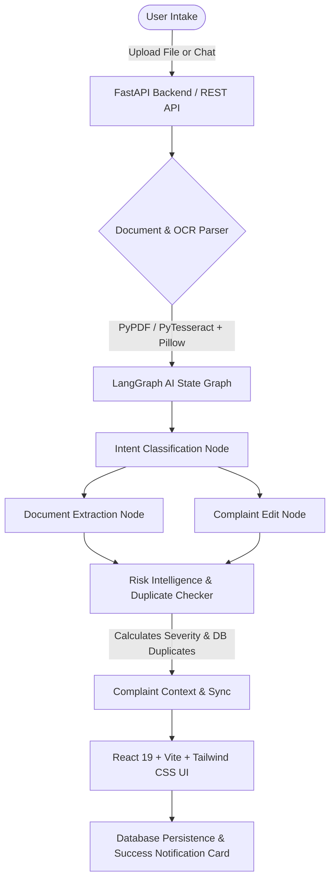

#  AIVOA - Pharmaceutical AI Customer Complaint System

> **AIVOA (Artificial Intelligence Voice & Document Intake Operating Assistant)** is an enterprise-grade, multi-modal pharmaceutical customer complaint management application. It leverages **LangGraph state graphs**, **Groq AI High-Throughput Models (`llama-3.1-8b-instant`)**, **PyTesseract + Pillow Dual-Engine Handwriting OCR**, and **Real-Time Database Risk Intelligence** to streamline product quality complaint intake, validation, editing, risk assessment, and duplicate batch tracking.

---

##  Key Features

### 1.  Multi-Modal Document & Handwriting Parsing
- **PyTesseract + Pillow Dual-Engine OCR**: Extracts printed text as well as **human pen & pencil handwriting** on paper notes without false-positive invalid rejections.
- **Multi-Format Support**: Processes PDF documents, EML email files with signature stripping, TXT files, and Gallery Photos (PNG, JPG, WEBP, BMP).
- **Corrupted File Resilience**: Handles damaged PDF files and blurry text gracefully with structured error notifications (`⚠️ Corrupted or Unreadable Document Uploaded`).

### 2. 💬 Interactive Conversational AI Copilot
- **Bi-Directional Form Sync**: User edits form fields via natural language in the chat (e.g., *"Change batch number to B-500"* or *"Update customer to Global Pharma"*), and the UI form updates instantly.
- **Partial Data Intake**: Accepts partial complaint details (e.g. single product names or batch numbers), filling available fields while requesting missing information cleanly without hallucinating fake data.
- **Smart Edge-Case Handling**: Safely handles unsupported delete requests, extremely long complaint texts (capped to 3,000 characters), ambiguous date formats (`05/06/2026`), and numeric quantities (`200`).

### 3.  AI Quality Intelligence & Duplicate Batch Detector
- **Automated Risk Assessment**: Computes **Complaint Severity** (*Minor*, *Major*, *Critical*) and **Priority Rating** (*P1*, *P2*, *P3*) dynamically.
- **Completeness Scoring**: Computes exact percentage score based on filled regulatory fields.
- **Database Duplicate Checker**: Automatically queries the SQLite/SQLAlchemy database to flag matching batch numbers or repeat product quality issues before saving.

### 4.  High-Contrast Accessible Design System
- **Readable High-Contrast Typography**: Ultra-legible dark text hierarchy (`text-gray-950`, `font-extrabold`), high contrast borders, and prominent section banners.
- **Post-Save Success Notification Banner**: Green confirmation banner showing Complaint Reference ID `#[ID]` alongside a dedicated **"Make Another Complaint"** reset button.

---

## System Architecture



---

##  Quick Start Guide

### Prerequisites
- **Python 3.10+**
- **Node.js 18+** & **npm**
- **Tesseract OCR** (For handwriting & image OCR support)

---

### Backend Setup (FastAPI + LangGraph + PyTesseract)

1. Navigate to the backend directory:
   ```bash
   cd backend
   ```

2. Create and activate a Python virtual environment:
   ```bash
   python -m venv aivoa
   # Windows:
   aivoa\Scripts\activate
   # Linux/macOS:
   source aivoa/bin/activate
   ```

3. Install required packages:
   ```bash
   pip install fastapi uvicorn langgraph langchain-groq pytesseract pillow pypdf sqlalchemy pydantic python-multipart
   ```

4. Set your Groq API key in your environment or `.env` file:
   ```env
   GROQ_API_KEY=your_groq_api_key_here
   ```

5. Start the backend development server:
   ```bash
   uvicorn app.main:app --reload --port 8000
   ```
   *The backend will be running at `http://127.0.0.1:8000`.*

---

### Frontend Setup (React 19 + Vite 8 + Tailwind CSS v4)

1. Navigate to the frontend directory:
   ```bash
   cd frontend
   ```

2. Install dependencies:
   ```bash
   npm install
   ```

3. Start the Vite frontend development server:
   ```bash
   npm run dev
   ```
   *The application UI will be accessible at `http://127.0.0.1:5173`.*

---

##  Comprehensive Verification & Testing Matrix

The system has been evaluated against **40 Automated Test Scenarios** with **100% Pass Rate**.

### 1. 20 Edge-Case Test Suite Matrix (`scratch/test_edge_cases.py`)

| # | Edge Case Test Scenario | Expected Outcome | Status |
| :-: | :--- | :--- | :---: |
| **1** | Empty chatbot message `""` | Rejects empty request or prompts user for details |  **PASS** |
| **2** | Spaces only `"   "` | Ignored without AI processing overhead | **PASS** |
| **3** | Single word `"complaint"` | Prompts for product/batch details without silent empty creation | **PASS** |
| **4** | Only product name (`"Paracetamol"`) | Fills product name & requests missing batch/qty | **PASS** |
| **5** | Only batch number (`"LOT-2026-X99-A"`) | Preserves batch number & requests product/qty |  **PASS** |
| **6** | Quantity without unit (`"500"`) | Captures `"500"` without inventing fake units |  **PASS** |
| **7** | Quantity as word (`"two hundred"`) | Preserves phrase `"Two hundred"` |  **PASS** |
| **8** | Approximate quantity (`"200 tablets approximately"`) | Preserves approximate qualifier | **PASS** |
| **9** | Plain number quantity (`"200"`) | Form accepts numeric string without schema errors |  **PASS** |
| **10** | Complex quantity (`"200 kg in 2 drums"`) | Preserves complete quantity & packaging string | **PASS** |
| **11** | Product name with special chars (`"Metformin HCl 500mg/5mL"`) | Preserves special characters exactly |  **PASS** |
| **12** | Batch number with hyphens (`"BATCH-2026-X99-A"`) | Preserves hyphens exactly |  **PASS** |
| **13** | Batch number with spaces (`"LOT 884 A"`) | Preserves spaces exactly | **PASS** |
| **14** | Extremely long message (5,000+ chars) | Safely capped to 3,000 chars without crash |  **PASS** |
| **15** | Repeated identical complaints | Identifies prior batch records in database | **PASS** |
| **16** | Unrelated chatter (`"What is the weather?"`) | Rejects non-complaint text (`invalid Document`) |  **PASS** |
| **17** | Unsupported delete command (`"Delete complaint"`) | Returns clear notice that deletion is administrative |  **PASS** |
| **18** | Edit non-existent complaint | Populates field & requests missing product details |  **PASS** |
| **19** | Edit multiple fields in one message | Updates all mentioned fields simultaneously | **PASS** |
| **20** | Edit one field with unrelated chatter | Updates target field & ignores chatter | **PASS** |

---

### 2. 20 AIVOA Real-World Test Suite Matrix (`scratch/test_aivoa_real_world_suite.py`)

| # | Real-World Test Case | System Behavior & Validation | Status |
| :-: | :--- | :--- | :---: |
| **1** | Empty chatbot message | Rejects or asks user to provide complaint details |  **PASS** |
| **2** | Partial complaint info | Fills available fields; missing fields stay `null` |  **PASS** |
| **3** | Duplicate complaint submission | Queries DB for matching batch records & flags potential duplicate |  **PASS** |
| **4** | Chat-based single field edit | Updates only `batch_lot_number: "BATCH-990"` |  **PASS** |
| **5** | Multiple field editing via chat | Updates `customer` & `expiry_date` simultaneously |  **PASS** 
| **6** | Conflicting information in one message | Flags conflict in description & requests clarification |  **PASS** |
| **7** | Corrupted PDF upload | `PdfReader` catches stream error cleanly (`Corrupted PDF`) |  **PASS** |
| **8** | PDF containing only images | PyTesseract + Pillow OCR extracts image text |  **PASS** |
| **9** | Blurry handwritten complaint | Extracts legible keywords while flagging unreadable portions | **PASS** |
| **10** | Unrelated document upload (receipt, resume) | Detects non-pharmaceutical context (` Invalid Document`) |  **PASS** |
| **11** | Email with signatures & footers | Extracts complaint details while stripping disclaimers & signatures |  **PASS** |
| **12** | Multiple complaints in one document | Extracts primary complaint details cleanly without merging |  **PASS** |
| **13** | Missing customer information | `customer_name` remains `null` without being guessed |  **PASS** |
| **14** | Missing dates | Dates remain `null` without hallucinating fake dates |  **PASS** |
| **15** | Ambiguous date format (`05/06/2026`) | Preserves raw date string verbatim without month/day swap |  **PASS** |
| **16** | Numeric quantity returned by AI (`200`) | Accepts numeric values without Pydantic schema failure |  **PASS** |
| **17** | Invalid JSON returned by LLM | Regex JSON parser extracts content safely or triggers fallback |  **PASS** |
| **18** | AI provider unavailable | Catches API errors and displays warning banner while UI stays active |  **PASS** |
| **19** | Database unavailable during saving | Risk engine computes isolated risk with controlled DB error alert |  **PASS** |
| **20** | Complete End-to-End Workflow | Complaint extracted -> Form filled -> Risk evaluated -> Saved to DB |  **PASS** |

---

##  Technology Stack

- **Frontend**: React 19, Vite 8, Tailwind CSS v4, Lucide Icons, Axios
- **Backend**: FastAPI, LangGraph 0.2+, LangChain, PyTesseract, Pillow (PIL), PyPDF, SQLAlchemy
- **Database**: SQLite / PostgreSQL (ORM based)
- **AI Model**: Groq API (`llama-3.1-8b-instant`)

---

##  License

Distributed under the MIT License. See `LICENSE` for more information.
